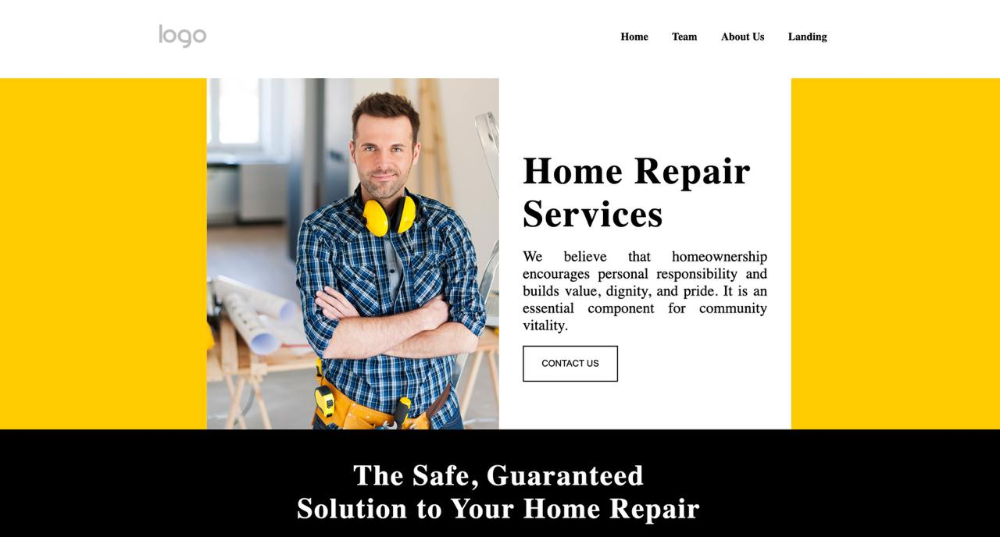

<div align="center">

# Quality Handyman Service

**A modern and responsive website designed for a construction and handyman business.**

[**➥ Live Demo**](https://sarah-petrosyan.github.io/Quality-handyman-service/)

</div>

---

## About the Project

This project is a clean and responsive website designed for a construction and handyman service business.  
The page features a strong landing section along with structured areas that introduce the company, services, and team.

The layout focuses on clarity, usability, and a professional business-style design that helps showcase services and company values.

It was built to practice front-end development fundamentals while focusing on layout design, responsive structure, and styling.

✅ Built with **HTML & CSS**  
✅ Fully responsive layout  
✅ Clean UI inspired by modern business websites  
✅ Beginner-friendly front-end project

---

## Demo Screenshot



---

## Getting Started

Make sure you have [Git](https://git-scm.com/downloads) installed. Then run:

```bash
git clone https://github.com/Sarah-petrosyan/Quality-handyman-service.git
```
